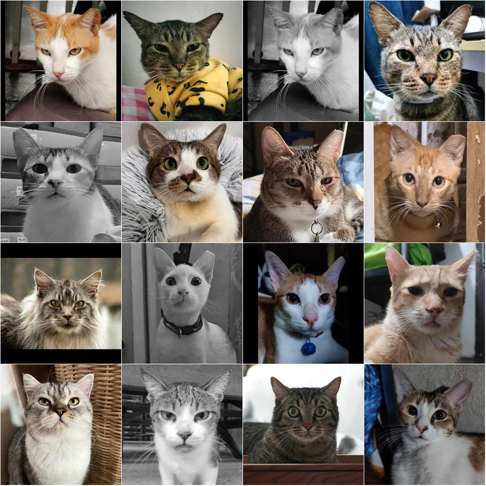
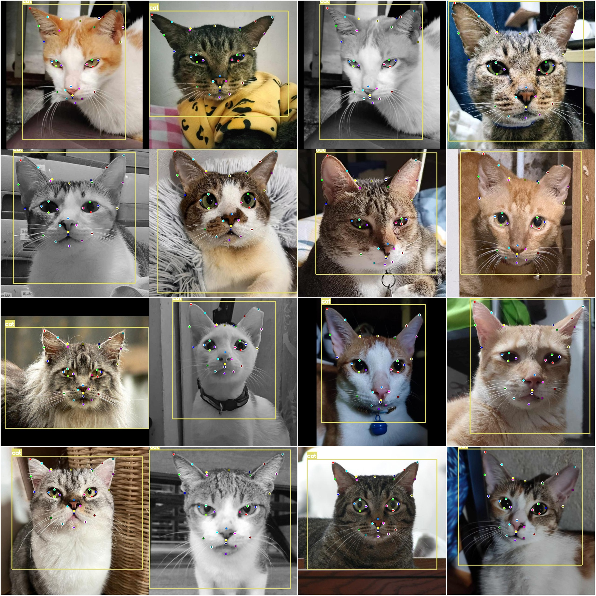

# Cat Face Keypoint Detection Dataset COCO+YOLO format 159 images with 1 category and 31 keypoints

Dataset format: YOLO keypoints format (Note that this is not the target detection or segmentation YOLO format, it only contains jpg image and corresponding yolo format txt file)
number of images: 159  
annotation count: 159  
Number of training set: 120
Number of validation set: 26
Number of test set: 13
annotationnumber of classes: 1  
annotation class names:['cat']  
31
keypoints=["Right-Base-Right-Ear","Right-Mid-Right-Ear","Tip-Right-Ear","Left-Mid-Right-Ear","Left-Base-Right-Ear","Back-Right-Ear","Back-Left-Ear","Right-Base-Left-Ear","Right-Mid-Left-Ear",
"Tip-Left-Ear","Left-Mid-Left-Ear","Left-Base-Left-Ear","Lateral-Right-Eye","Medial-Right-Eye","Top-Right-Eye","Bottom-Right-Eye","Medial-Left-Eye","Lateral-Left-Eye","Top-Left-Eye","Bottom-Left-Eye",
"Top-Right-Muzzle","Top-Left-Muzzle","Top-Muzzle","Bottom-Muzzle","Lateral-Right-Muzzle","Lateral-Left-Muzzle","Bottom-Right-Muzzle","Bottom-Left-Muzzle","Top-Head","Nose","Chin"]  
The number of boxes labeled in each category:
cat box count =159  
Total box count = 159
image resolution: 640x640  
Important notes: The dataset has been pre-split for YOLOv5-pose, YOLOv8-pose, YOLOv11-pose, or YOLOv26-pose training.
Special statement: This dataset does not guarantee the accuracy of the trained model or weight files.
Image preview:
Annotation example:
## Images

Here is a pay link on Stripe ( https://buy.stripe.com/3cs8yP7sY87d0vu9AB ). Please contact me lonlonago@foxmail.com after funding $89, and I will send you a complete data files , thank you!

